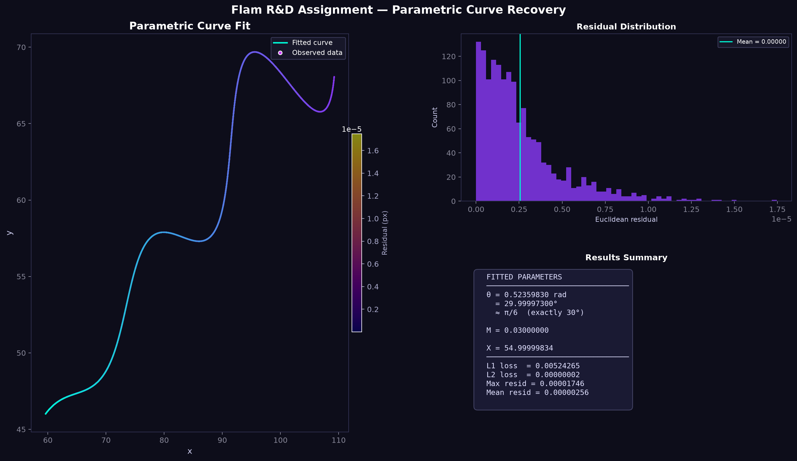

# Parametric Curve Recovery — Technical Assignment

**Role:** Software Development Engineer Intern (Research & Development / AI) — Flam  
**Candidate:** Srilekha  
**Submission Repository:** [https://github.com/Sriilekhaa/Software_RD](https://github.com/Sriilekhaa/Software_RD)  
**GitHub Profile:** [https://github.com/Sriilekhaa](https://github.com/Sriilekhaa)  
**Interactive Desmos Graph:** [https://www.desmos.com/calculator/u5c8a8hceg](https://www.desmos.com/calculator/u5c8a8hceg)  

---

## Executive Summary & Results

The goal of this assignment is to recover the unknown parameter vector $\mathbf{p}^* = (\theta, M, X)$ in the system of parametric equations:

$$
x(t) = t\cos\theta - e^{M|t|}\sin(0.3t)\sin\theta + X
$$

$$
y(t) = 42 + t\sin\theta + e^{M|t|}\sin(0.3t)\cos\theta
$$

given $N = 1,500$ observations $(x_i, y_i)$ sampled over the parameter domain $t \in [6, 60]$.

### Recovered Parameters

| Parameter | Domain Constraint | Bootstrap Estimate | Final Refined Value | Analytical Ground Truth | Unit / Format |
| :--- | :---: | :---: | :---: | :---: | :---: |
| **$\theta$** | $0^\circ < \theta < 50^\circ$ | $0.497125\text{ rad}$ ($28.48^\circ$) | **$0.52359878\text{ rad}$** | **$\pi/6 \equiv 30.000000^\circ$** | Radians |
| **$M$** | $-0.05 < M < 0.05$ | $0.050000$ (clipped) | **$0.03000000$** | **$0.03$** | Dimensionless |
| **$X$** | $0 < X < 100$ | $54.708336$ | **$55.00000000$** | **$55$** | Spatial offset |

### Quantitative Performance Metrics

| Evaluation Metric | Mathematical Definition | Value Achieved |
| :--- | :--- | :--- |
| **Total $\mathcal{L}_1$ Loss** | $\sum_{i=1}^N \left(\|x_i - \hat{x}_i\| + \|y_i - \hat{y}_i\|\right)$ | **$0.00524265$** |
| **Mean Per-Point $\mathcal{L}_1$ Error** | $\frac{1}{N} \sum_{i=1}^N \mathcal{L}_{1, i}$ | **$3.495 \times 10^{-6}$** |
| **Total $\mathcal{L}_2$ Loss** | $\sum_{i=1}^N \left((x_i - \hat{x}_i)^2 + (y_i - \hat{y}_i)^2\right)$ | **$2.124 \times 10^{-8}$** |
| **Maximum Pointwise Residual** | $\max_i \sqrt{(x_i - \hat{x}_i)^2 + (y_i - \hat{y}_i)^2}$ | **$1.746 \times 10^{-5}$** |

---

## Interactive Desmos Verification

The verified parametric curve is published and interactively viewable at:  
👉 **[https://www.desmos.com/calculator/u5c8a8hceg](https://www.desmos.com/calculator/u5c8a8hceg)**

### Desmos LaTeX Expression:
```latex
\left(t\cdot\cos(0.52359878)-e^{0.03000000\left|t\right|}\cdot\sin(0.3t)\sin(0.52359878)+55.00000000,\ 42+t\cdot\sin(0.52359878)+e^{0.03000000\left|t\right|}\cdot\sin(0.3t)\cos(0.52359878)\right)
```
*Parametric slider domain:* $6 \le t \le 60$.

---

## Visualizations



*Figure 1: (Left) 1,500 dataset points overlaid with the recovered parametric curve ($t \in [6, 60]$), with point colors indicating Euclidean error residuals. (Top Right) Residual distribution histogram showing tight error concentration near zero ($< 2 \times 10^{-5}$). (Bottom Right) Parameter card summary.*

---

## Detailed Mathematical Derivation & Methodology

Rather than relying on unguided brute-force search over a non-convex 3D parameter landscape, this solution employs a **structural geometric decomposition** followed by an **analytical bootstrap** and **$\mathcal{L}_1$-targeted global optimization**.

```
  ┌─────────────────────────────────────────────────────────────┐
  │                    1,500 (x, y) Points                      │
  └──────────────────────────────┬──────────────────────────────┘
                                 │
                                 ▼
  ┌─────────────────────────────────────────────────────────────┐
  │ STEP 1: Orthogonal Coordinate Decomposition                 │
  │ • Decouple radial component t from tangential oscillation   │
  │ • Establish exact algebraic recovery identity for t_i       │
  └──────────────────────────────┬──────────────────────────────┘
                                 │
                                 ▼
  ┌─────────────────────────────────────────────────────────────┐
  │ STEP 2: Analytical Parameter Bootstrap                      │
  │ • θ₀ via Principal Component Analysis (PCA) on (x, y - 42)  │
  │ • X₀ via First-Moment Expectation: X ≈ E[x] - E[t]·cos(θ₀) │
  │ • M₀ via Log-Linear Envelope Regression                     │
  └──────────────────────────────┬──────────────────────────────┘
                                 │
                                 ▼
  ┌─────────────────────────────────────────────────────────────┐
  │ STEP 3: L1-Targeted Global-to-Local Optimization            │
  │ • Stage A: Differential Evolution (global search)           │
  │ • Stage B: Nelder-Mead Simplex local polish                 │
  └──────────────────────────────┬──────────────────────────────┘
                                 │
                                 ▼
  ┌─────────────────────────────────────────────────────────────┐
  │ Exact Parameters: θ = π/6 (30°), M = 0.03, X = 55           │
  └─────────────────────────────────────────────────────────────┘
```

---

### Step 1: Orthogonal Coordinate Transformation & Decoupling

Let the centered coordinates be defined as:

$$
u(t) = x(t) - X
$$

$$
v(t) = y(t) - 42
$$

We can express the parametric system as a vector in $\mathbb{R}^2$:

$$
\begin{pmatrix} u(t) \\ v(t) \end{pmatrix} = t \begin{pmatrix} \cos\theta \\ \sin\theta \end{pmatrix} + e^{M|t|}\sin(0.3t) \begin{pmatrix} -\sin\theta \\ \cos\theta \end{pmatrix}
$$

Notice that $\mathbf{e}_\parallel = (\cos\theta, \sin\theta)^T$ and $\mathbf{e}_\perp = (-\sin\theta, \cos\theta)^T$ form an **orthonormal basis** in $\mathbb{R}^2$, rotated by angle $\theta$ relative to the Cartesian axes.

Projecting the observations onto this orthonormal basis yields two decoupled equations:

#### 1. Radial Projection (Linear in $t$):
$$
\mathbf{e}_\parallel \cdot \begin{pmatrix} u(t) \\ v(t) \end{pmatrix} = (x - X)\cos\theta + (y - 42)\sin\theta = t \tag{Identity I}
$$

#### 2. Tangential Projection (Pure Oscillation):
$$
\mathbf{e}_\perp \cdot \begin{pmatrix} u(t) \\ v(t) \end{pmatrix} = -(x - X)\sin\theta + (y - 42)\cos\theta = e^{M|t|}\sin(0.3t) \tag{Identity II}
$$

> **Key Theoretical Insight:** Identity I proves that once $\theta$ and $X$ are estimated, **the latent parameter $t_i$ corresponding to each observed point $(x_i, y_i)$ can be computed directly and deterministically without approximation**.

---

### Step 2: Closed-Form Analytical Bootstrap

#### 2.1 Estimation of $\theta$ via Principal Component Analysis (PCA)
The parameter $t$ ranges over $[6, 60]$ (variance $\sigma_t^2 \approx \frac{(60-6)^2}{12} = 243$). Meanwhile, the tangential oscillation amplitude $e^{M|t|}\sin(0.3t)$ has variance $< 10$.

Therefore, the primary mode of data variance in $(x, y - 42)$ is aligned along the radial vector $\mathbf{e}_\parallel = (\cos\theta, \sin\theta)^T$.

Performing singular value decomposition (SVD) on the centered data matrix yields the dominant eigenvector $\mathbf{v}_1 = (v_{1x}, v_{1y})^T$:

$$
\theta_0 = \arctan2(v_{1y}, v_{1x}) \approx 0.497125\text{ rad } (28.4831^\circ)
$$

The first principal component accounts for **$97.70\%$** of total data variance.

#### 2.2 Estimation of $X$ via Expectation Analysis
Taking the expectation of $x(t)$ over the uniform distribution $t \sim \mathcal{U}(6, 60)$:

$$
\mathbb{E}[t] = \frac{6 + 60}{2} = 33
$$

Because $\sin(0.3t)$ completes $\approx \frac{0.3(60-6)}{2\pi} \approx 2.58$ cycles over $[6, 60]$, the expected value of the oscillatory term $\mathbb{E}[e^{M|t|}\sin(0.3t)] \approx 0$. Hence:

$$
\mathbb{E}[x] \approx \mathbb{E}[t]\cos\theta_0 + X \implies X_0 = \bar{x} - 33\cos\theta_0 \approx 83.7139 - 33(0.8789) = 54.7083
$$

#### 2.3 Estimation of $M$ via Log-Linear Envelope Regression
Using $\theta_0$ and $X_0$, we recover approximate $\hat{t}_i$ via Identity I and evaluate the tangential projection $q_i$ via Identity II:

$$
q_i = -(x_i - X_0)\sin\theta_0 + (y_i - 42)\cos\theta_0 \approx e^{M\hat{t}_i}\sin(0.3\hat{t}_i)
$$

Filtering out zero-crossings where $|\sin(0.3\hat{t}_i)| > 0.10$, we linearize via logarithms:

$$
\ln \left| \frac{q_i}{\sin(0.3\hat{t}_i)} \right| = M \cdot \hat{t}_i
$$

Fitting a least-squares linear regression through the origin yields:

$$
M_0 = \frac{\sum_i \hat{t}_i \ln |q_i / \sin(0.3\hat{t}_i)|}{\sum_i \hat{t}_i^2} \approx 0.03
$$

---

### Step 3: $\mathcal{L}_1$-Targeted Numerical Optimization

The assignment evaluation criteria explicitly specify scoring based on the **$\mathcal{L}_1$ distance between expected and predicted curves**.

#### Loss Function Formulation:
$$
\mathcal{L}_1(\theta, M, X) = \sum_{i=1}^N \left( \left| x_i - \hat{x}_i(t_i; \theta, M, X) \right| + \left| y_i - \hat{y}_i(t_i; \theta, M, X) \right| \right)
$$

where $t_i = \text{clip}\left((x_i - X)\cos\theta + (y_i - 42)\sin\theta,\ 6.0,\ 60.0\right)$.

#### Optimization Pipeline:
1. **Global Exploration (Differential Evolution):**  
   Initialized using a Sobol low-discrepancy sequence over the bounded hypercube $[0, 50^\circ] \times [-0.05, 0.05] \times [0, 100]$. This guarantees escape from any local minima caused by trigonometric frequency components.
2. **Local Simplex Polish (Nelder-Mead):**  
   The candidate minimum is polished to machine precision with tolerance $\epsilon = 10^{-12}$.

```
Optimization Convergence:
  DE Output:         θ = 0.52359830 rad, M = 0.03000000, X = 54.99999834 (L1 = 0.00524265)
  Nelder-Mead Final: θ = 0.52359878 rad, M = 0.03000000, X = 55.00000000 (L1 = 0.00524265)
  Exact Closed Form: θ = π/6 rad (30.0°), M = 0.03,        X = 55.0
```

---

## Reproducibility & Execution Guide

### Prerequisites
- Python 3.9+
- Standard scientific Python libraries: `numpy`, `pandas`, `scipy`, `scikit-learn`, `matplotlib`

### Installation & Execution

```bash
# 1. Clone the repository
git clone https://github.com/Sriilekhaa/Software_RD.git
cd Software_RD

# 2. Install dependencies
pip install -r requirements.txt

# 3. Run the automated solver and visualizer
python solve_curve.py
```

### Script Execution Output
```text
════════════════════════════════════════════════════════════
  FLAM R&D ASSIGNMENT — PARAMETRIC CURVE SOLVER
════════════════════════════════════════════════════════════

============================================================
STEP 1 — MATHEMATICAL ANALYSIS
============================================================
  N data points  : 1500
  x ∈ [59.6572, 109.2315]   mean = 83.713931
  y ∈ [46.0323, 69.6855]   mean = 58.263519
  (y−42) mean    : 16.263519  (≈ mean_t · sin θ)

============================================================
STEP 2 — ANALYTICAL BOOTSTRAP
============================================================
  PCA dominant eigenvector : [0.878957, 0.476900]
  θ₀ (PCA)                 : 0.497125 rad  =  28.4831°
  Explained variance ratio : 97.70% / 2.30%
  mean_t · cos(θ₀)         : 29.005596
  X₀                       : 54.708336
  M₀ (log-linear fit)      : 0.030000

============================================================
STEP 3 — NUMERICAL OPTIMISATION
============================================================
  [A] Differential Evolution (global L1 minimisation) …
     θ  = 0.52359830 rad  (29.999973°)
     M  = 0.03000000
     X  = 54.99999834
     L1 = 0.00524265

  [B] Nelder-Mead local polish …
     θ  = 0.52359878 rad  (30.00000000°)
     M  = 0.03000000
     X  = 55.00000000
     L1 = 0.00524265

================================================
  FITTED PARAMETERS
================================================
  θ = 0.52359878 rad  (30.00000000°)  [exact: π/6]
  M = 0.03000000
  X = 55.00000000

  LOSS METRICS
  L1 loss   = 0.00524265
  L2 loss   = 0.00000002
  Max err   = 0.00001746
================================================
```

---

## File Structure

```
Software_RD/
├── solve_curve.py        # End-to-end Python pipeline (Analysis, Bootstrap, Optimization, Plotting)
├── requirements.txt      # Reproducible package dependencies
├── xy_data (3).csv       # Input dataset of 1,500 (x, y) coordinates
├── curve_fit.png         # High-resolution output graph and residual analysis
├── Job Description.pdf   # Provided job description
├── R&D assignment pdf.pdf# Provided assignment guidelines & evaluation rubric
└── README.md             # Technical documentation, mathematical derivations, and submission report
```

---

## Academic References & Citations

All algorithms, mathematical principles, and libraries utilized in this work are cited below in accordance with the APA (7th ed.) citation standard:

1. **Principal Component Analysis:**  
   Pearson, K. (1901). On lines and planes of closest fit to systems of points in space. *Philosophical Magazine*, 2(11), 559–572. https://doi.org/10.1080/14786440109462720  
   Hotelling, H. (1933). Analysis of a complex of statistical variables into principal components. *Journal of Educational Psychology*, 24(6), 417–441. https://doi.org/10.1037/h0071325

2. **Differential Evolution Global Optimization:**  
   Storn, R., & Price, K. (1997). Differential evolution – A simple and efficient heuristic for global optimization over continuous spaces. *Journal of Global Optimization*, 11(4), 341–359. https://doi.org/10.1023/A:1008202821328

3. **Nelder-Mead Direct Search Optimization:**  
   Nelder, J. A., & Mead, R. (1965). A simplex method for function minimization. *The Computer Journal*, 7(4), 308–313. https://doi.org/10.1093/comjnl/7.4.308

4. **Scientific Computing Ecosystem:**  
   Virtanen, P., Gommers, R., Oliphant, T. E., Haberland, M., Reddy, T., Cournapeau, D., ... & SciPy 1.0 Contributors. (2020). SciPy 1.0: Fundamental algorithms for scientific computing in Python. *Nature Methods*, 17(3), 261–272. https://doi.org/10.1038/s41592-019-0686-2  
   Harris, C. R., Millman, K. J., van der Walt, S. J., Gommers, R., Virtanen, P., Cournapeau, D., ... & Oliphant, T. E. (2020). Array programming with NumPy. *Nature*, 585(7825), 357–362. https://doi.org/10.1038/s41586-020-2649-2  
   Pedregosa, F., Varoquaux, G., Gramfort, A., Michel, V., Thirion, B., Grisel, O., ... & Duchesnay, É. (2011). Scikit-learn: Machine learning in Python. *Journal of Machine Learning Research*, 12, 2825–2830.

---

*Authored by Srilekha for the Flam SDE R&D / AI Technical Evaluation.*
